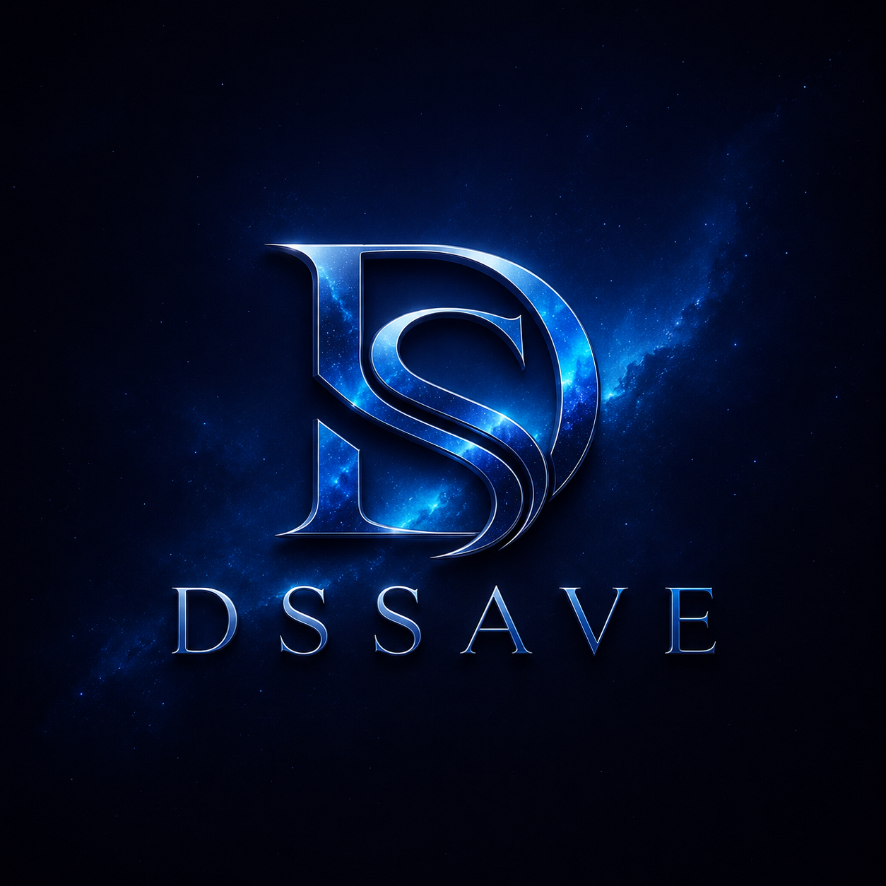

<div align="center">
  

  # DSSAVE

  **Free, fast, and watermark-free video & audio downloader**

  Download from YouTube, TikTok, Instagram, Facebook, X (Twitter), and Pinterest — no registration required.

  
  
  
  
  
  
  
</div>

---

## Features

- **6 Supported Platforms** — YouTube, TikTok, Instagram, Facebook, X (Twitter), Pinterest
- **Multiple Qualities** — 360p, 720p HD, 1080p Full HD
- **Audio Extraction** — MP3 and WAV formats
- **No Watermark** — clean downloads, no branding
- **No Registration** — just paste a link and download
- **PWA Support** — installable as a mobile app
- **Bilingual UI** — English & Bahasa Indonesia
- **Dark / Light Mode** — animated galaxy/nebula dark theme + light mode
- **Secure Backend** — rate limiting, Helmet.js, CORS protection

---

## Tech Stack

| Layer | Technology |
|-------|-----------|
| Frontend | React 19, TypeScript, Vite, Tailwind CSS 4, Framer Motion |
| Backend | Express 5, TypeScript, yt-dlp, FFmpeg |
| PWA | vite-plugin-pwa |
| Security | Helmet.js, express-rate-limit, CORS |
| Deployment | Vercel, Docker |

---

## Prerequisites

Before running locally, make sure you have:

- **Node.js** ≥ 18
- **Python 3** with [yt-dlp](https://github.com/yt-dlp/yt-dlp)
  ```bash
  pip install yt-dlp
  ```
- **FFmpeg** installed and available on your `PATH`
  - macOS: `brew install ffmpeg`
  - Ubuntu: `sudo apt install ffmpeg`
  - Windows: [ffmpeg.org/download](https://ffmpeg.org/download.html)

---

## Getting Started

```bash
# Clone the repo
git clone https://github.com/your-username/dssave.git
cd dssave

# Install dependencies
npm install

# Start dev server (frontend + backend concurrently)
npm run dev
```

- Frontend: [http://localhost:5173](http://localhost:5173)
- Backend API: [http://localhost:3001](http://localhost:3001)

---

## Available Scripts

| Script | Description |
|--------|-------------|
| `npm run dev` | Run frontend + backend in parallel |
| `npm run dev:fe` | Frontend only (Vite, port 5173) |
| `npm run dev:be` | Backend only (Express, port 3001) |
| `npm run build` | TypeScript compile + Vite production build |
| `npm run preview` | Preview the production build locally |
| `npm run lint` | Run ESLint |

---

## API Reference

All endpoints are prefixed with `/api`.

### `POST /api/info`
Fetch video metadata before downloading.

**Request body:**
```json
{ "url": "https://www.youtube.com/watch?v=..." }
```

**Response:**
```json
{
  "title": "Video Title",
  "thumbnail": "https://...",
  "uploader": "Channel Name",
  "platform": "youtube"
}
```

**Rate limit:** 10 requests / minute

---

### `POST /api/download`
Download a video or audio file.

**Request body:**
```json
{
  "url": "https://www.youtube.com/watch?v=...",
  "format": "mp4",
  "quality": "720"
}
```

| Field | Options |
|-------|---------|
| `format` | `mp4`, `mp3`, `wav` |
| `quality` | `360`, `720`, `1080` (ignored for audio) |

**Rate limit:** 3 downloads / minute (production)

---

### `GET /api/platforms`
Returns a list of supported platforms.

---

## Deployment

### Vercel

The project includes a `vercel.json` config. Deploy with:

```bash
vercel --prod
```

> **Note:** yt-dlp and FFmpeg must be available in your serverless environment. Consider using a dedicated server or Docker for production use.

### Docker

```bash
# Build image
docker build -t dssave .

# Run container
docker run -p 3001:3001 dssave
```

---

## Project Structure

```
dssave/
├── server/
│   └── index.ts              # Express API server
├── src/
│   ├── components/           # React UI components
│   │   ├── Hero.tsx          # Main downloader interface
│   │   ├── Navbar.tsx
│   │   ├── Footer.tsx
│   │   ├── FAQ.tsx
│   │   └── ...
│   ├── context/
│   │   └── LanguageContext.tsx   # i18n (EN / ID)
│   ├── utils/
│   │   └── translations.ts       # All UI strings
│   ├── hooks/
│   └── App.tsx
├── public/
├── Dockerfile
├── vercel.json
└── vite.config.ts
```

---

## Contributing

1. Fork the repository
2. Create a feature branch: `git checkout -b feat/your-feature`
3. Commit your changes: `git commit -m "feat: add your feature"`
4. Push and open a Pull Request

ESLint is configured — run `npm run lint` before submitting.

---

## License

MIT © [DSSAVE](https://github.com/your-username/dssave)
